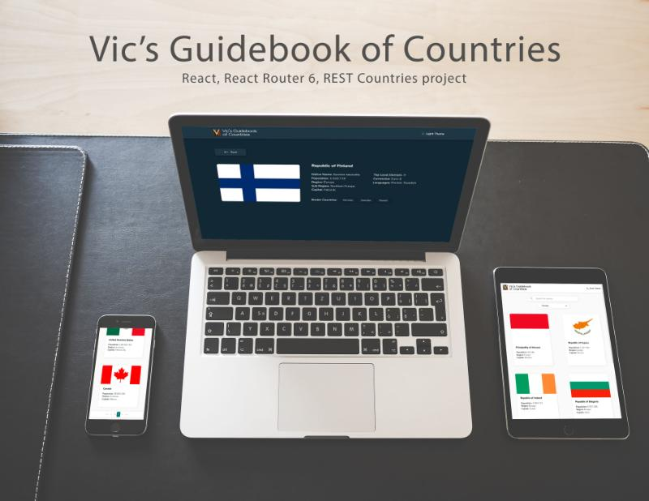

# Vic's Guidebook of Countries

Vic's Guidebook of Countries is a React-based project that serves as a comprehensive guidebook featuring information on various countries. The project utilizes data fetched from the REST Countries API, providing details such as flags, names, population, capitals, and more.



## Deployment

[Vic's Guidebook of Countries](https://vic-country-guide.netlify.app/){:target="_blank"}

## Table of Contents

- [Technologies Used](#technologies-used){:target="_blank"}
- [Features](#features){:target="_blank"}
- [Installation](#installation){:target="_blank"}

## Technologies Used

The project is built using the following technologies:

- [React](https://reactjs.org/){:target="_blank"}
- [React Router 6](https://reactrouter.com/){:target="_blank"}
- [Sass (SCSS)](https://sass-lang.com/){:target="_blank"}
- [BEM Methodology](http://getbem.com/){:target="_blank"}
- [axios](https://axios-http.com/){:target="_blank"}

Include links to the official documentation for each technology to help users unfamiliar with them.

## Features

Vic's Guidebook of Countries offers the following features, inspired by the [original challenge](https://www.frontendmentor.io/challenges/rest-countries-api-with-color-theme-switcher-5cacc469fec04111f7b848ca){:target="_blank"} and with additional enhancements:

- **Displaying Countries Information:** View details such as flags, names, population, capitals, and more for each country.

- **Search by Country Name:** Easily search for a specific country by entering its name in the search bar. The search feature dynamically updates the list of countries with suitable results. If no suitable results are found, the list displays 'There is no such country...'

- **Filter by Region:** Filter the displayed countries based on their regions.

- **Pagination:** Implemented pagination for easier navigation through the list of countries. In the desktop version, it appears between the search input and filter list. In the mobile version, it is positioned at the bottom of the page for better UX. Clicking on pagination elements in the mobile version triggers an autoscroll to the top of the page.

- **Detailed Information:** Click on a country to see more detailed information on a separate page.

- **Border Countries Navigation:** Click through to the border countries on the detail page.

- **Responsive Design:** View the optimal layout for the interface depending on their device's screen size.

- **Interactive Elements:** See hover and focus states for all interactive elements on the page.

- **Toggle Color Scheme:** Toggle the color scheme between light and dark mode.

- **Error Page:** A custom error page (similar to a 404 page) is displayed when a user attempts to navigate to a non-existing page.

## Installation

To run the project locally, follow these steps:

1. Clone the repository:

```bash
git clone https://github.com/your-username/your-repository.git
```

2. Navigate to the project directory:

```bash
cd your-repository
```

3. Install dependencies:

```bash
npm install
```

4. Start the development server:

```bash
npm run dev
```

5. Visit 'http://localhost:your-port' in your browser to view the application.
